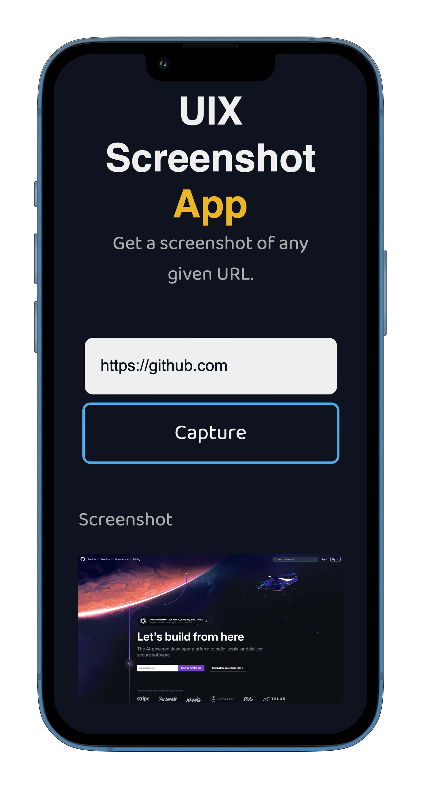

# Example: Shared Shopping List

This repository demonstrates some essential concept of the [UIX](https://uix.unyt.org) framework such as [pointers](https://unyt.org/glossary#pointer), [SSR](https://unyt.org/glossary#ssr) and [Web components](https://unyt.org/glossary#web-components) using the example of a **shared shopping list**.


The repository includes persistent data storage and implements both [front-end](https://unyt.org/glossary#back-end) and [back-end](https://unyt.org/glossary#back-end) rendering with [hydration](https://unyt.org/glossary#hydration).

## Installation
1. Install the **UIX command line tool** following the [Getting Started](https://docs.unyt.org/manual/uix/getting-started#the-uix-command-line-tool) guide in our documentation.

2. Clone this repository to your local machine:

	```bash
	$ git clone https://github.com/unyt-org/example-shared-list.git
	```
3. Run the project local
	```bash
	$ uix -wlb --port 8000
	```
4. Navigate to your favourite web browser and open http://localhost:8000 to see everything in action. 

## Structure
This diagram outlines the UIX default project structure.
We split our code base in [back-end](https://unyt.org/glossary#back-end), [front-end](https://unyt.org/glossary#front-end), and commons folder.
```
.
└── example-shared-list/
    ├── backend/
    │   ├── .dx                 // Config file for deployment
    │   └── entrypoint.tsx      // Back-end entrypoint
    ├── common/
    │   ├── compoments/
    │   │   ├── List.scss       // List style declaration
    │   │   ├── List.tsx        // List component
    │   │   ├── Overview.scss   // Overview style declaration
    │   │   └── Overview.tsx    // Overview component
    │   └── theme.ts            // Global style theme
    ├── frontend/
    │   ├── entrypoint.css      // Front-end style declaration
    │   └── entrypoint.tsx      // Front-end entrypoint
    ├── app.dx                  // Endpoint config file
    └── importmap.json          // Importmap
```

## Features
* Support for multiple synced lists
* Items can be checked/unchecked
* Items contain name, amount and unit
* Items can be added and removed
* Unchecked items can be auto-removed

## Preview



## Explanation
### Concept of Pointers
In [UIX](https://uix.unyt.org), [Pointers](https://unyt.org/glossary#pointer) are a fundamental concept for managing shared data across different parts of your application. Pointers allow different components or [endpoints](https://unyt.org/glossary#endpoint) to access and modify the same data. In the context of our shared shopping list, a Pointer could represent the list of items to buy.

Pointers are synchronized over the [Supranet](https://unyt.org/glossary#supranet), based on our powerful [DATEX](https://datex.unyt.org) networking protocol that ensures real-time updates and consistency across endpoints. When one user adds or removes an item from the shopping list, the changes are propagated to all connected endpoints through the Supranet, keeping the data in sync.

### Persistent Storage of Pointer Data
To provide a seamless experience, our shared shopping list app also demonstrates how to persistently store Pointer data. This means that even if the application is restarted, the shopping list will be up-to-date.

### Front-End Rendering and Hydration
UIX supports both front-end and back-end rendering with hydration. Front-end rendering allows us to create a dynamic and interactive user interface on the client side. When a user interacts with the shopping list (e.g., adds or removes items), the changes are reflected in real-time.

Hydration is the process of converting the initial HTML content sent from the server into a fully interactive UI on the client side. This ensures that the app is ready for user interactions as soon as it loads.

---

<sub>&copy; unyt 2023 • [unyt.org](https://unyt.org)</sub>
